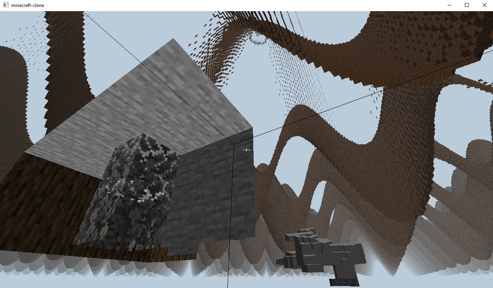

# voxel-mc-attempt

Fun attempt to make a voxel C++ Minecraft-like prototype focused only on core engine systems with chunked world
streaming, CPU meshing, a small client (OpenGL), and a few other features.

**Why?** — Why not! I had some free time to tinker.

---

## Key Features / General Overview

### Chunked world & streaming

* Columns of chunks; compile-time chunk constants (`CHUNK_BITS` controls chunk cubic size, and `CHUNKS_PER_COLUMN`
  defines world height in chunks per column).
* On-demand loading and unloading of columns with seed increments.
* Separation of concerns between generation, meshing, and rendering.
* Tightly packed 8B Vertex

### Synchronous `ChunkColumn` generation (parallelized with `std::async`)

* Generation is conceptually synchronous but uses `std::async` to spawn many threads and divide work across them.

### CPU meshing with layer separation

* Face culling and mesh generation on the CPU.
* Separate opaque (occluding) and cutout (alpha-tested) mesh layers for correct rendering passes.

### Tile-based texture atlas & UV packing

* Per-tile UV packing computed to minimize texture binds and reduce draw calls.

### GPU resource `BufferPool`

* VBO/EBO reuse to reduce OpenGL allocations and improve streaming performance.

### Frustum culling & distance sorting

* AABB frustum tests and distance-based sorting.
* Render order: occluding → cutout (e.g., leaves).

### Deterministic terrain options

* Seedable Perlin noise generator.
* Simple sine-wave generator available for quick comparisons.

### Voxel interaction

* Hotbar (keyboard + scroll wheel) block selection and input handling.
* Camera movement and looking around.
* Raycast-based block placement and breaking.

### Used tools & dependencies

* C++ & Python
* CMake + vcpkg
* OpenGL, GLFW, GLAD, GLM, spdlog, stb
* Visual Studio profiler to inspect CPU hotspots

---

### What could be done next?

* Persistent chunk storage (currently in-memory only).
* Greedy meshing and GPU occlusion queries.
* Multithreaded `ChunkColumn` generation and `MeshColumn` meshing using thread pools and job queues (blocking with
  `std::mutex` or non-blocking with `std::atomic`).
* Implement a server component (currently stubbed).

---

### Screenshots

#### Image Descriptions

The screenshots portray the world with a **Euclidean render radius of 32 ChunkColumns** and a **column height of 8
chunks**.  
Each chunk is **32×32×32 blocks**, so the world height is **256 blocks in total**.

- **Screenshots 1, 2 and 3** — Sine-wave terrain generation
- **Screenshot 4** — Perlin-noise terrain generation

Chunks and chunk meshes inside their columns are stored as smart pointers. When a chunk contains only air, or when its
mesh has no visible vertices, the smart pointer is `null` (no allocation) to save memory.

#### Visible Features in the Scenes

- **World size and render radius**
- **Face culling** — only visible faces are meshed and rendered
- **Opaque → Cutout render passes**
    - Leaves are alpha-tested (transparent) and can be seen through
    - Adjacent leaf blocks render only the one outer shared face on their common axis to avoid texture flicker

---

#### Performance

Performance measured for the entire world generation that size, using synchronous but parallelized generation and
meshing:

- **Sine-wave terrain**:
    - ~250 ms for ChunkColumns generation
    - ~1500 ms for MeshColumns meshing

- **Perlin-noise terrain**:
    - ~280 ms for ChunkColumns generation
    - ~2200 ms for MeshColumns meshing

These values are approximate and depend on CPU, thread scheduling, and workload distribution.

#### Additional Note (Transition / Streaming)

When streaming new ChunkColumns due to camera movement only the outer ring is generated and meshed.
On the same world settings setup, both terrain generators show approximately:

- ~3 ms for ChunkColumns generation
- ~25 ms for MeshColumns meshing

---

### Screenshots Preview

